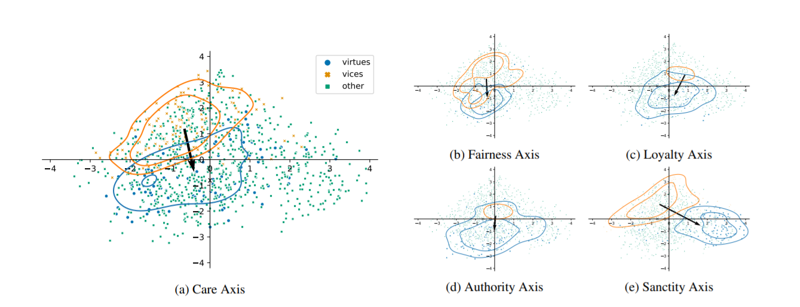

# Studying Moral-based Differences in the Framing of Political Tweets

This repository contains the code for the paper `Studying Moral-based Differences in the Framing of Political Tweets`. ([Preprint is available here](https://arxiv.org/abs/2103.11853))

The paper deals with moral framing using five moral foundations: (a) care, (b) fairness, (c) loyalty, (d) authority, and (e) sanctity.  
The experiments are conducted in Austrian and US based Twitter data.  

TLDR: we find that different moral values are associated with different political messages spread by US & Austrian politicians via Twitter.



## Structure

The repo consists of 5 notebooks corresponding to the following 5 sections in the paper:
- [Capturing Moral Frames](frame_axis.ipynb)
- [Validation of Moral Frame Axes](1_validation_of_moral_frame_axes.ipynb)
- [Validation on Annotated Tweets](2_validation_on_annotated_tweets.ipynb)
- [Moral-based Framing in US-based Tweets](3_moral_based_framing_in_us_based_tweets.ipynb)
- [Moral-based Framing in Austrian-based Tweets](4_moral_based_framing_in_austrian_based_tweets.ipynb)

Plots of the five moral axis are provided in [plots](plots/).  
Additonally, some example are outlined in [examples.ipynb](examples.ipynb).

## Cite

Bibtex for Preprint, please use the published version once available (will be updated here):

```
@misc{reiterhaas2021studying,
      title={Studying Moral-based Differences in the Framing of Political Tweets}, 
      author={Markus Reiter-Haas and Simone Kopeinik and Elisabeth Lex},
      year={2021},
      eprint={2103.11853},
      archivePrefix={arXiv},
      primaryClass={cs.SI}
}
```
